<!-- Animated header -->

  

  

    
  
    

  
  
  
   
  
  

 

<h2>👤 Professional Summary</h2>

 

Senior Test Engineer with 6.5 years of experience testing payments, banking and telecom software. I build UI and API automation that runs in CI and catches defects before release, and I test every layer of an application: what users click, what the APIs return and what ends up in the database.

- **Current Focus:** UI and API test automation with Selenium, Karate and REST Assured
- **Latest Role:** Senior Test Engineer at LTIMindTree, on the Western Union account (digital payments and money transfer)
- **Domain Expertise:** Payments, banking, telecom and financial services
- **DevOps Exposure:** Jenkins pipelines, Docker containers and AWS test environments
- **Location and Availability:** Pune, India. Open to QA automation roles in Pune & Remote
- **Languages:** English, Hindi, Marathi

<h2>🛠️ Technical Skills</h2>

 

  

 

- **Testing Types:** Functional, regression, integration, system, UAT, smoke, sanity, compatibility, GUI, API, globalization
- **Framework Design:** Page Object Model, data-driven, BDD and hybrid frameworks with parallel execution on Chrome, Firefox and IE

<h2>🚀 Automation Frameworks & Projects</h2>

 

| Focus Area | Project | Skills Demonstrated |
| --- | --- | --- |
| UI Automation Framework | [BDD Cucumber Automation Project](https://github.com/liteshz1778/BDD_Cucumber_Automation_Project) | Selenium WebDriver, Core Java and BDD Cucumber automating the NopCommerce demo store, with screenshots as evidence |
| UI Automation Framework | [UI Automation (OrangeHRM)](https://github.com/liteshz1778/UI_Automation) | Selenium, TestNG and a data-driven framework, with screenshots as evidence |
| API Automation Framework | [REST Assured Automation](https://github.com/liteshz1778/RestAssuredAutomation) | REST Assured, Core Java, TestNG and external test data, with logs and reports |
| API Automation Framework | [Karate Booking API Tests](https://github.com/liteshz1778/KarateFramework_BookingAPITest) | Karate framework, Maven and a central configuration file |
| CI/CD Pipeline Automation | [Docker and Jenkins Demo Pipeline](https://github.com/liteshz1778/docker_jenkins_demo_pipeline) | Jenkinsfiles that build Docker images, push them to Docker Hub and deploy containers |
| Onboarding Assessment | [LTIM Assignment 1 and 3](https://github.com/liteshz1778/LTIMAssignment1-3) | UI and REST API automation assignment completed during onboarding for the Western Union project at LTIMindtree |

<h2>💼 Professional Experience</h2>

 

| Period | Role | Organisation | Domain |
| --- | --- | --- | --- |
| Apr 2024 to Jan 2026 | Senior Test Engineer | LTIMindTree (client: Western Union) | Digital payments and money transfer |
| Jul 2023 to Jan 2024 | DevOps Engineer Intern | Web Soft IT Solutions | AWS, Docker, Jenkins |
| Nov 2021 to Jun 2023 | Test Analyst | Bitwise Solutions (client: Global Payments) | Payment processing |
| Dec 2020 to Nov 2021 | Test Engineer | QualityKiosk Technologies | Banking |
| May 2019 to Dec 2020 | Software Test Engineer | Kastham Technologies | Telecom and financial services |

<h2>🎓 Certifications & Education</h2>

 

**Cloud and DevOps Certifications**

- [AWS Certified Cloud Practitioner](https://www.credly.com/badges/4b4a07da-2f17-4f1e-a7d3-8e8f2d9840f3/public_url) (Amazon Web Services)
- [Terraform Basic Training](https://drive.google.com/file/d/1hFJfO7uy8Bmp5AzfwckwV6vWiZSdDafA/view?usp=sharing) (KodeKloud)
- [Helm for Beginners](https://drive.google.com/file/d/1za4R7vW9BiBj8br8CqwAgN-_w2k53ZOo/view?usp=sharing) (KodeKloud)
- [Ansible Basic Training](https://drive.google.com/file/d/1JxCQ30G57xE5-FO89owgsiDf-6UsOGMl/view?usp=sharing) (KodeKloud)
- [Ansible Advanced Training](https://drive.google.com/file/d/1VId1SE8SGYMx5INRwm32GpGJWgmzpRpr/view?usp=sharing) (KodeKloud)
- [Certified Kubernetes Administrator (CKA) with Practice Tests](https://drive.google.com/file/d/1OXgvT6BqFUJUmI0Ptsx9UCZpzEe6P09r/view?usp=sharing) (Udemy)

**API Testing Certifications**

- [REST API Testing & Automation Using Postman](https://drive.google.com/file/d/1ZDgOKyPGfd_nFa-uc-7gtHqW1usqID0k/view?usp=sharing) (Udemy)
- [REST API Automation With Rest Assured](https://drive.google.com/file/d/16E2eHr2bgScjb9_4tCHXx4Zk4_zFjn68/view?usp=sharing) (Udemy)

**Academic Qualifications**

- **MCA:** Master of Computer Applications, Savitribai Phule Pune University, 2022
- **BCS:** Bachelor of Computer Science, Savitribai Phule Pune University, 2019

  
<h2>📊 Stats & 📈 Activity Graph</h2>

  <!--- https://github.com/DenverCoder1/DenverCoder1/blob/main/README.md ------>
  <table align="center" cellspacing="0" cellpadding="0">
    <tr>
      <td align="center" valign="center">
         <!------- https://github.com/Pranesh-2005/github-readme-stats-fast --->
        
          
        <!---- https://streak-stats.demolab.com/demo/ -------->
        
      </td>
      <td align="center" valign="top">
          <!------- https://github.com/Pranesh-2005/github-readme-stats-fast --->
        
      </td>
    </tr>
  </table>
  

      <!-- Generated by .github/workflows/activity-graph.yml (github-readme-activity-graph-action) -->
    
  

<h2>🤝 Contact & Availability</h2>

 

| Channel | Details | Action |
| --- | --- | --- |
| 📧 Email | litesh1778.zadane@gmail.com | [Open in mail app](mailto:litesh1778.zadane@gmail.com?subject=Opportunity%3A%20QA%20Automation%20Engineer%20role&body=Hi%20Litesh%2C%0A%0AI%20came%20across%20your%20GitHub%20profile%20and%20would%20like%20to%20discuss%20a%20QA%20automation%20role.%0A%0ARegards%2C) or [Compose in Gmail](https://mail.google.com/mail/?view=cm&fs=1&to=litesh1778.zadane@gmail.com&su=Opportunity%3A%20QA%20Automation%20Engineer%20role) |
| 📞 Phone | +91 8788485192 | [Tap to call from the portfolio](https://qa-portfolio-liteshz.vercel.app/#contact) |
| 🌐 Portfolio | qa-portfolio-liteshz.vercel.app | [Visit website](https://qa-portfolio-liteshz.vercel.app/) |
| 🐙 GitHub | liteshz1778 | [View profile](https://github.com/liteshz1778) |
| 🐳 Docker Hub | liteshz | [View images](https://hub.docker.com/u/liteshz) |

> **If a link does not open the expected app:** for email, use the Gmail option or copy the address above. GitHub blocks direct `tel:` links, so the phone link opens my portfolio's contact section, where tap-to-call opens your phone dialer on mobile.

  

